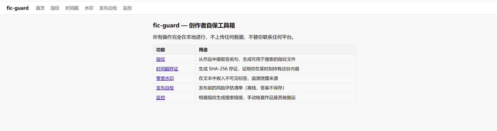
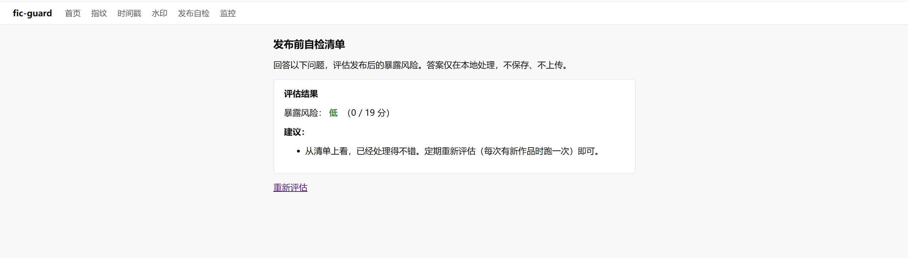

# fic-guard

> 给同人 / 原创作者的自保工具箱：文本指纹、零宽水印、时间戳存证、跨站搜索、发布前自检。
> 完全本地运行，不上传任何数据，不替你联系任何平台。



## 这是什么

如果你是一名 fiction 写作者——无论是同人还是原创——你的作品可能在你不知情的情况下被搬运到其他站点、整理进资源群、或被打包传播。`fic-guard` 不能阻止这些事情发生（任何能被读者看到的内容，原则上都可以被复制），但它能帮你做四件具体的事：

1. **指纹**：从你的作品中挑出几条最具识别度的句子，未来可以用这些句子去搜索引擎或可疑站点反查，确认是不是同一份内容。
1. **水印**：在文本里嵌入肉眼看不到的零宽字符标签，比如给每个发布平台嵌一个不同的标签，一旦在第三方看到内容，能追溯来源。
1. **时间戳存证**：给作品生成一份 SHA-256 哈希存证文件。配合 [OpenTimestamps](https://opentimestamps.org)，可以把”我在 X 时间已经持有这份内容”锚定到比特币区块链上，免费、无需账号。
1. **发布前自检**：一个本地交互式清单，帮你过一遍可见性设置、身份关联、备份情况等容易踩坑的点，给出具体建议。



## 工具的定位

- **本地优先。** 所有操作在你自己的设备上完成，不上传任何数据。
- **不替你做决定。** 是否发布、发布到哪里、用什么身份发布，都是你的选择。这个工具只在你做决定前提供信息。
- **不指名道姓任何人或团体。** 如果你看到的搬运行为构成侵权，请走平台投诉或法律渠道。

为什么这样设计：见 [`docs/why-not-a-callout-site.md`](docs/why-not-a-callout-site.md)。

## 下载预编译版（推荐给不想装 Python 的用户）

前往本仓库的 **[Releases 页面](https://github.com/Mice999/fic-guard/releases)**，下载对应你系统的文件，双击即可使用，无需安装 Python：

|系统                 |文件名                        |
|-------------------|---------------------------|
|Windows 64位        |`fic-guard-windows-x64.exe`|
|macOS Apple Silicon|`fic-guard-macos-arm64`    |
|macOS Intel        |`fic-guard-macos-x86_64`   |
|Linux 64位          |`fic-guard-linux-x64`      |

**注意事项**：

- **macOS**：下载后先在终端执行 `chmod +x fic-guard-macos-*`。第一次打开会被 Gatekeeper 拦截，到”系统设置 → 隐私与安全性”点”仍要打开”；或者右键点击文件 → 选择”打开” → 在弹窗里点”打开”（macOS 15+ 推荐）。
- **Windows**：可能出现 SmartScreen 提示，点”更多信息 → 仍要运行”即可。
- 预编译版不附带示例文件，直接用你自己的 `.txt` 文件即可。

> ⚠️ **当前为 alpha 版本，欢迎试用和反馈。** v0.2 正在完善中。

## 快速上手

### 方式一：图形界面（推荐）

下载预编译版后，在终端运行：

```bash
fic-guard web
```

浏览器会自动打开，所有功能都可以在网页上操作，无需记忆命令。

### 方式二：命令行

```bash
# 1. 给你的作品生成指纹
fic-guard fingerprint make ./mywork.txt --work-id mywork-ch1

# 2. 生成时间戳存证
fic-guard timestamp make ./mywork.txt --work-id mywork-ch1

# 3.（可选）发布到不同平台时，各嵌入一个不同的隐形标签
fic-guard fingerprint watermark ./mywork.txt --payload site-A --output mywork.site-A.txt

# 4. 定期检查作品是否出现在别处
fic-guard monitor .fic-guard/mywork-ch1.fingerprint.json

# 5. 发布前过一遍自检清单
fic-guard safe-publish
```

所有产物默认放在 `.fic-guard/` 目录下，请纳入私人备份，**不要上传到公开仓库**。

## 从源码安装

需要 Python 3.9+：

```bash
pip install -e .
```

## 进阶阅读

- [`docs/threat-model.md`](docs/threat-model.md) — 工具假设的风险来源，能做什么、不能做什么
- [`docs/why-not-a-callout-site.md`](docs/why-not-a-callout-site.md) — 为什么不做公示墙
- [`docs/patterns/`](docs/patterns/) — 已知的搬运手法和应对方式
- [`docs/incident-response.md`](docs/incident-response.md) — 如果发现作品被搬运了，先做什么

## 项目状态

Alpha。功能可用，欢迎试用和反馈。下一阶段开发计划见 [`docs/roadmap-v0.2.md`](docs/roadmap-v0.2.md)。

欢迎 issue 和 PR，但**请阅读 <CONTRIBUTING.md> 里关于「我们不接受什么」的部分**。

## License

MIT。详见 <LICENSE>。